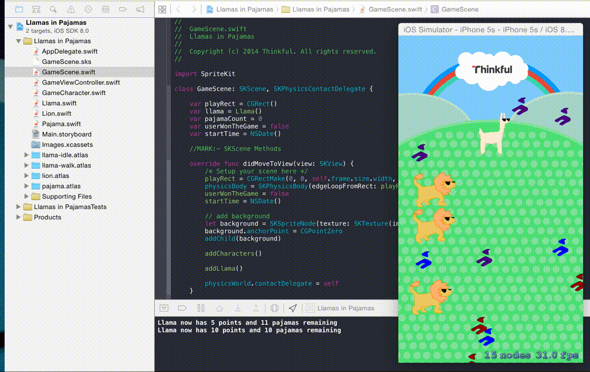

# Llamas in Pajamas

A SpriteKit game written in Swift for iOS 8.

# Notes

This project is part of Thinkful's course [Intro to iOS Programming in Swift](http://thinkful.com)

Feedback is certainly welcome :)

# Authors

- Jeremy Cartier [@jcartier](https://twitter.com/jcartier)
- Brendon Roberto [@brebory](https://twitter.com/brebory)
- Brian Schachter [@262Hz](https://github.com/262hz)